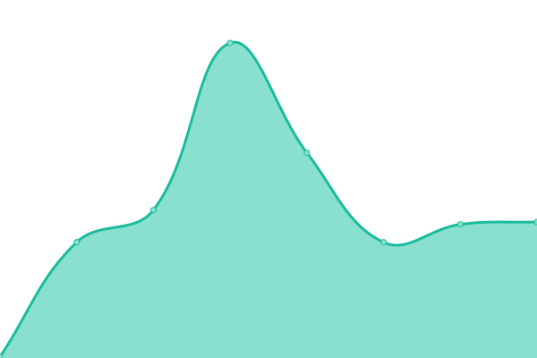

# [📈 Live Status](https://nxthdr.github.io/upptime): <!--live status--> **🟥 Complete outage**

This repository contains the open-source uptime monitor and status page for [nxthdr](https://nxthdr.dev), powered by [Upptime](https://github.com/upptime/upptime).

With [Upptime](https://upptime.js.org), you can get your own unlimited and free uptime monitor and status page, powered entirely by a GitHub repository. We use [Issues](https://github.com/nxthdr/upptime/issues) as incident reports, [Actions](https://github.com/nxthdr/upptime/actions) as uptime monitors, and [Pages](https://nxthdr.github.io/upptime) for the status page.

Please also check out [Ping](https://stats.uptimerobot.com/7aSyrqWaj9) connectivity.

<!--start: status pages-->
<!-- This summary is generated by Upptime (https://github.com/upptime/upptime) -->
<!-- Do not edit this manually, your changes will be overwritten -->
<!-- prettier-ignore -->
| URL | Status | History | Response Time | Uptime |
| --- | ------ | ------- | ------------- | ------ |
|  [[v4] nxthdr.dev](https://nxthdr.dev) | 🟥 Down | [v4-nxthdr-dev.yml](https://github.com/nxthdr/upptime/commits/HEAD/history/v4-nxthdr-dev.yml) | 

 1136ms
     
 | 

<a href="https://nxthdr.github.io/upptime/history/v4-nxthdr-dev">96.56%</a>
    

|  [[v6] nxthdr.dev](https://nxthdr.dev) | 🟥 Down | [v6-nxthdr-dev.yml](https://github.com/nxthdr/upptime/commits/HEAD/history/v6-nxthdr-dev.yml) | 

 784ms
     
 | 

<a href="https://nxthdr.github.io/upptime/history/v6-nxthdr-dev">96.79%</a>
    

|  [[v4] blog.nxthdr.dev](https://blog.nxthdr.dev) | 🟥 Down | [v4-blog-nxthdr-dev.yml](https://github.com/nxthdr/upptime/commits/HEAD/history/v4-blog-nxthdr-dev.yml) | 

 1513ms
     
 | 

<a href="https://nxthdr.github.io/upptime/history/v4-blog-nxthdr-dev">93.40%</a>
    

|  [[v6] blog.nxthdr.dev](https://blog.nxthdr.dev) | 🟥 Down | [v6-blog-nxthdr-dev.yml](https://github.com/nxthdr/upptime/commits/HEAD/history/v6-blog-nxthdr-dev.yml) | 

 996ms
     
 | 

<a href="https://nxthdr.github.io/upptime/history/v6-blog-nxthdr-dev">93.40%</a>
    

|  [[v4] docs.nxthdr.dev](https://docs.nxthdr.dev) | 🟥 Down | [v4-docs-nxthdr-dev.yml](https://github.com/nxthdr/upptime/commits/HEAD/history/v4-docs-nxthdr-dev.yml) | 

 1124ms
     
 | 

<a href="https://nxthdr.github.io/upptime/history/v4-docs-nxthdr-dev">93.41%</a>
    

|  [[v6] docs.nxthdr.dev](https://docs.nxthdr.dev) | 🟥 Down | [v6-docs-nxthdr-dev.yml](https://github.com/nxthdr/upptime/commits/HEAD/history/v6-docs-nxthdr-dev.yml) | 

 1061ms
     
 | 

<a href="https://nxthdr.github.io/upptime/history/v6-docs-nxthdr-dev">93.42%</a>
    

|  [[v4] geofeed.nxthdr.dev](https://geofeed.nxthdr.dev) | 🟥 Down | [v4-geofeed-nxthdr-dev.yml](https://github.com/nxthdr/upptime/commits/HEAD/history/v4-geofeed-nxthdr-dev.yml) | 

 1165ms
     
 | 

<a href="https://nxthdr.github.io/upptime/history/v4-geofeed-nxthdr-dev">96.81%</a>
    

|  [[v6] geofeed.nxthdr.dev](https://geofeed.nxthdr.dev) | 🟥 Down | [v6-geofeed-nxthdr-dev.yml](https://github.com/nxthdr/upptime/commits/HEAD/history/v6-geofeed-nxthdr-dev.yml) | 

 628ms
     
 | 

<a href="https://nxthdr.github.io/upptime/history/v6-geofeed-nxthdr-dev">96.82%</a>
    

|  [[v4] peers.nxthdr.dev](https://peers.nxthdr.dev) | 🟥 Down | [v4-peers-nxthdr-dev.yml](https://github.com/nxthdr/upptime/commits/HEAD/history/v4-peers-nxthdr-dev.yml) | 

 1122ms
     
 | 

<a href="https://nxthdr.github.io/upptime/history/v4-peers-nxthdr-dev">96.82%</a>
    

|  [[v6] peers.nxthdr.dev](https://peers.nxthdr.dev) | 🟥 Down | [v6-peers-nxthdr-dev.yml](https://github.com/nxthdr/upptime/commits/HEAD/history/v6-peers-nxthdr-dev.yml) | 

 930ms
     
 | 

<a href="https://nxthdr.github.io/upptime/history/v6-peers-nxthdr-dev">96.83%</a>
    

<!--end: status pages-->

[**Visit our status website →**](https://nxthdr.github.io/upptime)

## 📄 License

- Powered by: [Upptime](https://github.com/upptime/upptime)
- Code: [MIT](./LICENSE) © [Anand Chowdhary](https://anandchowdhary.com), supported by [Pabio](https://pabio.com)
- Data in the `./history` directory: [Open Database License](https://opendatacommons.org/licenses/odbl/1-0/)
